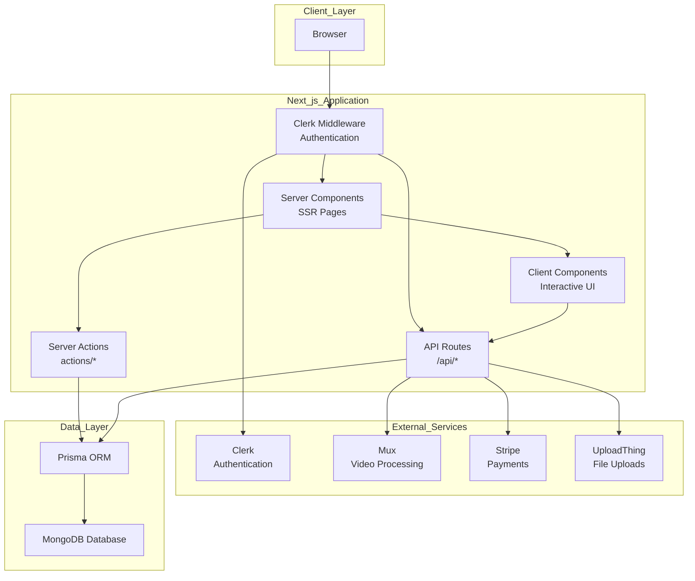
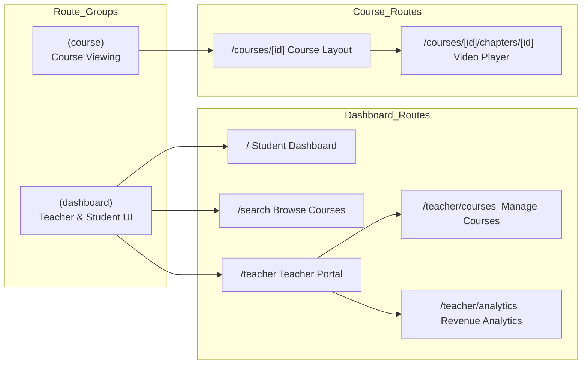
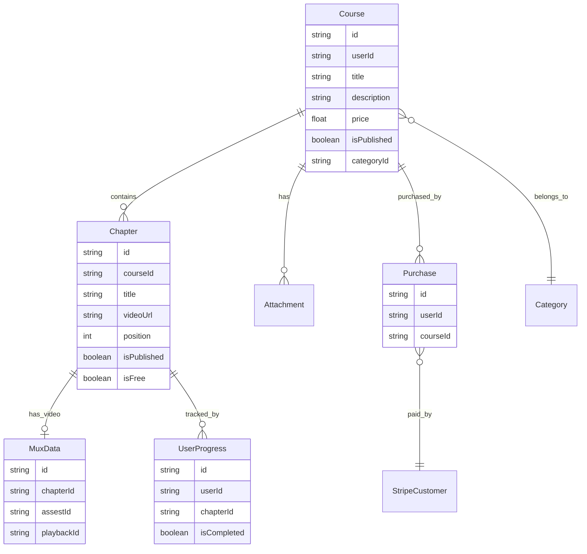
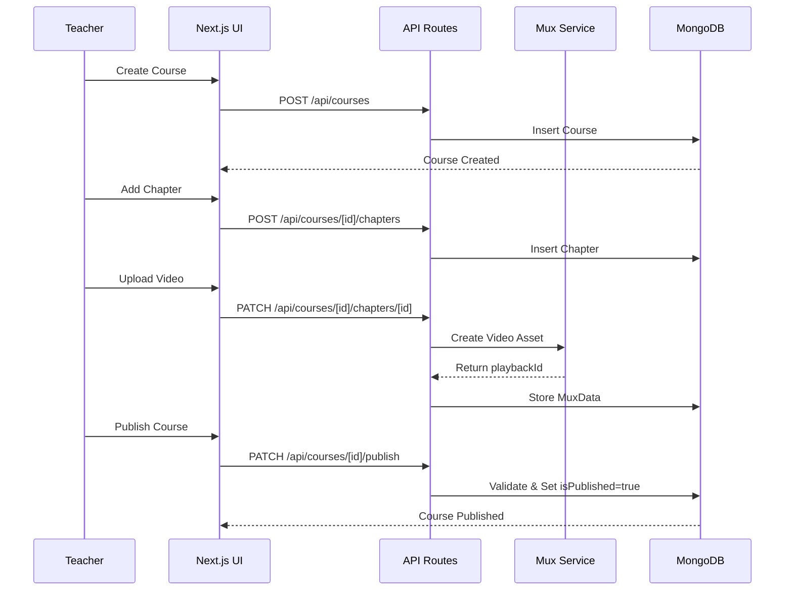
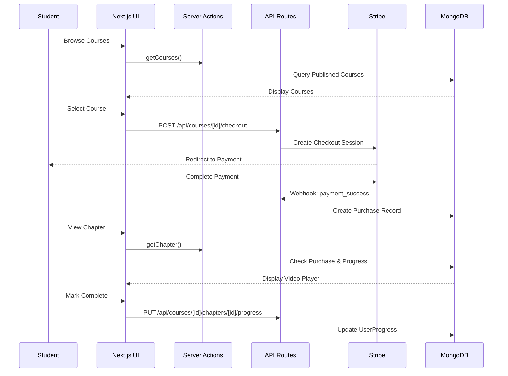
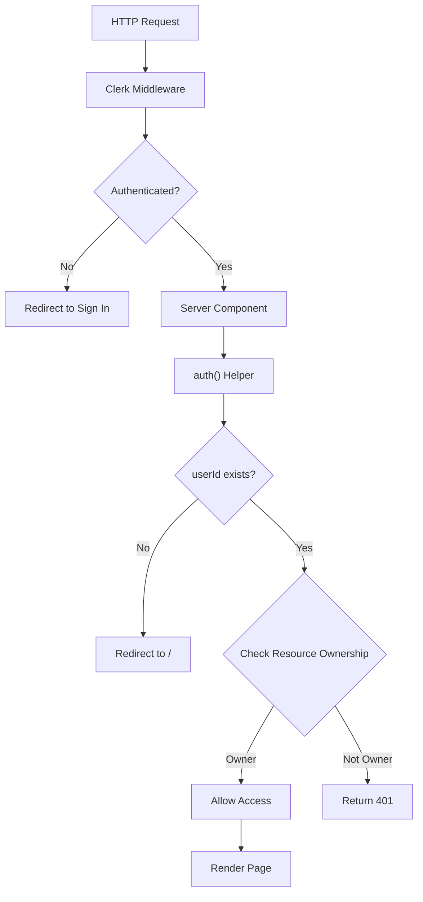
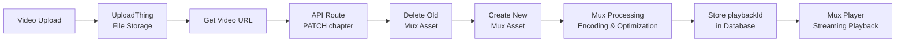
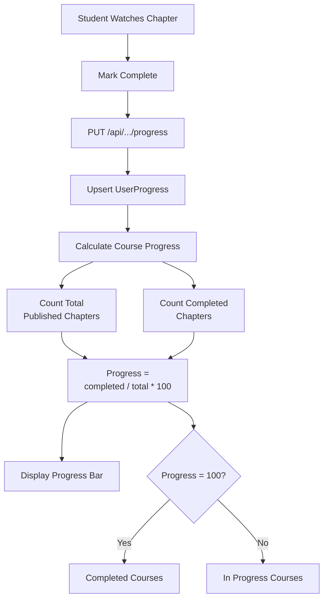

# LMS Platform

The LMS Platform is a modern, full-stack Learning Management System (LMS) built with **Next.js 14**, designed to enable teachers to create and manage video-based courses and provide students with an intuitive learning experience. The platform leverages a server-first architecture with **MongoDB** as the database, **Clerk** for authentication, **Mux** for video processing, and **Stripe** for payments.

## Table of Contents
- [Features](#features)
- [Technology Stack](#technology-stack)
- [System Architecture](#system-architecture)
- [Architecture Diagrams](#architecture-diagrams)
- [Setup Instructions](#setup-instructions)
- [Usage](#usage)
  - [Teacher Workflow](#teacher-workflow)
  - [Student Workflow](#student-workflow)
- [Database Schema](#database-schema)
- [Key Design Decisions](#key-design-decisions)
- [Contributing](#contributing)
- [License](#license)

## Features
- **Teacher Features**:
  - Create and manage video-based courses with chapters and supplementary materials.
  - Upload videos via UploadThing, processed by Mux for adaptive streaming.
  - Publish courses and chapters with validation for required fields.
  - View revenue and sales analytics.
- **Student Features**:
  - Browse and filter published courses by category or title.
  - Purchase courses via Stripe with secure checkout.
  - Track progress with chapter-level completion and visual progress bars.
  - Stream videos with Mux’s adaptive bitrate playback.
  - Celebrate course completion with confetti animations.
- **General Features**:
  - Secure authentication at the edge with Clerk.
  - Responsive and optimized UI with Next.js Server and Client Components.
  - Type-safe database operations with Prisma ORM.

## Technology Stack
- **Frontend & Backend**: Next.js 14 (App Router, Server Components, Server Actions, API Routes)
- **Database**: MongoDB with Prisma ORM
- **Authentication**: Clerk (edge-based middleware)
- **Video Processing**: Mux (encoding, CDN streaming)
- **Payments**: Stripe (checkout sessions, webhooks)
- **File Uploads**: UploadThing (CDN storage for videos and attachments)
- **Styling**: Tailwind CSS (assumed based on modern Next.js practices)
- **Deployment**: Vercel (recommended for Next.js)

## System Architecture
The LMS Platform follows a layered architecture with clear separation of concerns:

- **Client Layer**: Users access the platform via web browsers over HTTP/HTTPS.
- **Application Layer** (Next.js 14):
  - **Server Components**: Handle server-side rendering for fast initial loads and SEO.
  - **Client Components**: Provide interactive UI elements (e.g., video players, progress bars).
  - **API Routes** (`/api/*`): Manage mutations and integrations with external services.
  - **Server Actions** (`actions/*`): Optimize server-side data fetching for read operations.
- **External Services**:
  - **Clerk**: Edge-based authentication and session management.
  - **Mux**: Video upload, encoding, and streaming via CDN.
  - **Stripe**: Payment processing and checkout sessions.
  - **UploadThing**: File uploads for videos and attachments.
- **Data Layer**: Prisma ORM provides type-safe access to a MongoDB database.

The application is organized into two route groups:
- **Dashboard Routes** (`/dashboard`): Student dashboard, course search, teacher portal, course management, and analytics.
- **Course Routes** (`/courses`): Course navigation and chapter video playback.

## Architecture Diagrams
The following diagrams illustrate the LMS Platform’s architecture. 

### High-Level System Architecture


### Application Structure


### Data Model Architecture


### Teacher Workflow Architecture


### Student Workflow Architecture


### Authentication & Authorization Flow


### Video Processing Pipeline


### Progress Tracking System


## Setup Instructions

### Prerequisites
- **Node.js**: v18 or higher
- **MongoDB**: Local or cloud instance (e.g., MongoDB Atlas)
- **Accounts and API Keys**:
  - Clerk (authentication)
  - Mux (video processing)
  - Stripe (payments)
  - UploadThing (file uploads)

### Installation
1. **Clone the Repository**:
   ```bash
   git clone https://github.com/your-org/lms-platform.git
   cd lms-platform
   ```

2. **Install Dependencies**:
   ```bash
   npm install
   ```

3. **Set Up Environment Variables**:
   Create a `.env.local` file in the root directory and add the following:
   ```env
   # Next.js
   NEXT_PUBLIC_CLERK_PUBLISHABLE_KEY=your_clerk_publishable_key
   CLERK_SECRET_KEY=your_clerk_secret_key

   # MongoDB
   DATABASE_URL=your_mongodb_connection_string

   # Mux
   MUX_TOKEN_ID=your_mux_token_id
   MUX_TOKEN_SECRET=your_mux_token_secret

   # Stripe
   STRIPE_SECRET_KEY=your_stripe_secret_key
   STRIPE_WEBHOOK_SECRET=your_stripe_webhook_secret

   # UploadThing
   UPLOADTHING_SECRET=your_uploadthing_secret
   UPLOADTHING_APP_ID=your_uploadthing_app_id

   # Next.js App URL
   NEXT_PUBLIC_APP_URL=http://localhost:3000
   ```

4. **Set Up Prisma**:
   ```bash
   npx prisma generate
   npx prisma db push
   ```

5. **Run the Development Server**:
   ```bash
   npm run dev
   ```
   The application will be available at `http://localhost:3000`.

6. **Configure Webhooks**:
   - Set up Stripe webhooks for payment success events at `/api/webhooks/stripe`.
   - Ensure the webhook URL is configured in the Stripe dashboard.

## Usage

### Teacher Workflow
1. **Sign In**: Authenticate via Clerk to access the teacher portal (`/teacher`).
2. **Create a Course**:
   - Navigate to `/teacher/courses` and fill out the course creation form (title, description, price, category).
   - Courses are unpublished by default.
3. **Add Chapters**:
   - Add chapters with titles, descriptions, and videos via the course management interface.
   - Upload videos through UploadThing; Mux processes them for streaming.
4. **Publish Content**:
   - Publish individual chapters and the course once all required fields are complete and at least one chapter is published.
5. **View Analytics**:
   - Access revenue and sales data at `/teacher/analytics`.

### Student Workflow
1. **Browse Courses**:
   - Visit `/search` to browse published courses, filter by category, or search by title.
2. **Purchase a Course**:
   - Select a course and proceed to Stripe’s checkout page.
   - Upon successful payment, gain access to all course content.
3. **View Content**:
   - Navigate to `/courses/[id]` to view course chapters.
   - Free chapters are accessible without purchase; others require a purchase record.
4. **Track Progress**:
   - Mark chapters as complete to update progress.
   - View progress in the course sidebar and dashboard, with confetti animations for course completion.

## Database Schema
The MongoDB schema, managed via Prisma, includes the following entities:
- **Course**: Stores metadata (title, description, price, publication status, category, owner user ID).
- **Chapter**: Represents lessons (title, video URL, position, publication status, free preview flag).
- **MuxData**: Stores Mux video metadata (asset ID, playback ID) linked to chapters.
- **UserProgress**: Tracks chapter completion with unique user-chapter constraints.
- **Purchase**: Records course purchases with unique user-course constraints.
- **Category**: Organizes courses for browsing.
- **Attachment**: Stores supplementary materials (e.g., PDFs).
- **StripeCustomer**: Links Clerk user IDs to Stripe customer IDs.

Relationships use cascade deletion to maintain data integrity (e.g., deleting a chapter removes associated progress and Mux data).

## Key Design Decisions
- **Server-First Architecture**: Uses Next.js Server Components and Server Actions for fast initial loads, SEO, and reduced client-side JavaScript.
- **Edge Authentication**: Clerk middleware authenticates requests at the edge for security and performance.
- **Delegated Video Processing**: Mux handles video encoding and streaming, simplifying infrastructure.
- **Granular Progress Tracking**: Chapter-level progress enables precise metrics and resume functionality.
- **Cascade Deletion**: Ensures referential integrity by automatically removing related data (e.g., progress records, Mux assets) when chapters or courses are deleted.

## Contributing
1. Fork the repository.
2. Create a feature branch (`git checkout -b feature/your-feature`).
3. Commit changes (`git commit -m "Add your feature"`).
4. Push to the branch (`git push origin feature/your-feature`).
5. Open a pull request.

